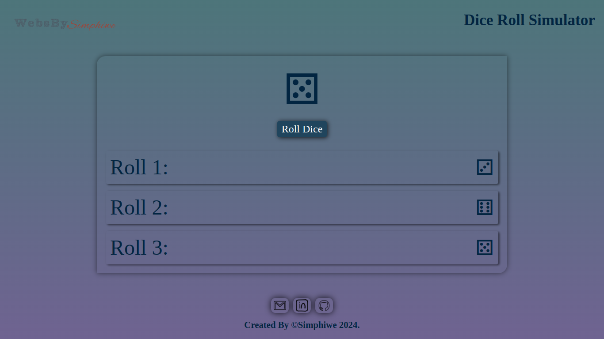
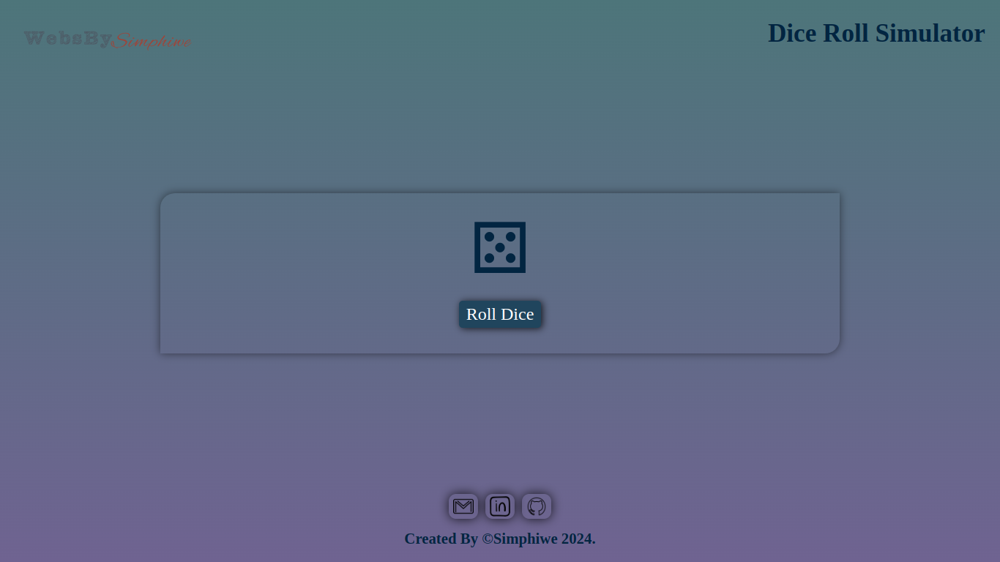

# Dice Roll Simulator

Check it _**LIVE**_ 👉
**<https://deebest.github.io/dice-roll-simulator/>**

A _**Dice Roll Simulator**_ web application I built with HTML,CSS and JavaScript, it simulates the dice rolling game. I built it as a part of my JavaScript learning journey.

## Uses

Can be enjoyed as a game of rolling a dice and taking to see which one got which dice face

## Tech Stack Used

- GIT
- HTML
- CSS
- JavaScript

## Get In Touch 👇

Email : **<simphiwedladla8@gmail.com>**

Linked: **<https://www.linkedin.com/in/dladla-simphiwe-89061a20a/>**

Github: **<https://github.com/DeeBest>**

Portfolio: **<https://deebest.github.io/personal-webpage/>**
